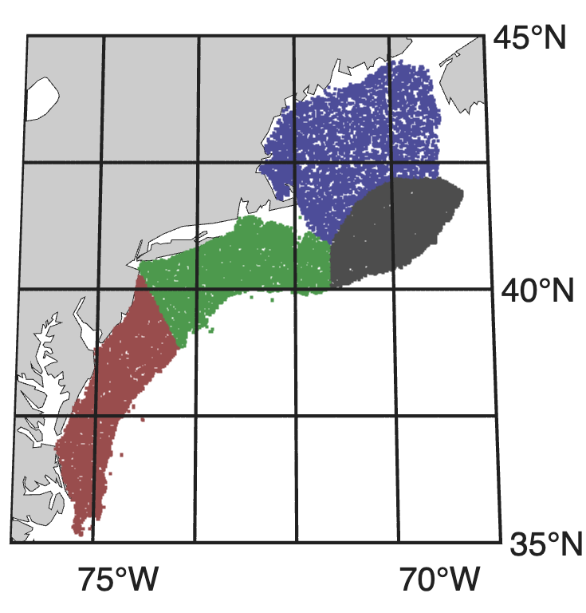
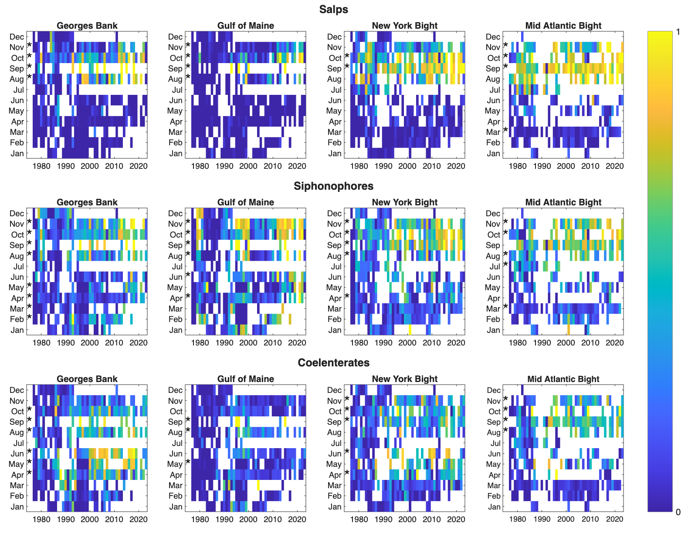

```{r setup, include=FALSE}
knitr::opts_chunk$set(echo = FALSE)
```

## Abstract

The Jelly Ocean Hypothesis posits that gelatinous zooplankton populations are increasing worldwide as a result of changing ocean conditions. This hypothesis has been the subject of debate in ocean science. We examined the Northeast US Continental Shelf for increases in the occurence of gelatinous zooplankton taxa using a 50-year survey and a species distribution model. Time series analysis showed statistically significant increases in salps, siphonophores, and coelenterates (scyphozoans) in late summer and early autumn across the entire study region. Species distribution models showed that the drivers of the occurence of gelatinous taxa were XYZ (oxygen?) ETCECT The results form one piece of evidence in favor of a long-term rise in gelatinous species. The roughly synchronized increases in these widly diverse taxa suggest that changes in environmental or ecological conditions favor a gelatinous body plan generally.

## Introduction

In the study of zooplankton ecology, there has often been a “crustaceocentric” bias [@haddock2004golden]. The study of gelatinous species, collectively termed gelata, has been underemphasized as compared to crustaceans. In the early 2000s, gelata moved into the spotlight, following conspicuous blooms that damaged fisheries [@kideys2005impacts], aquaculture [@clinton2021impacts], energy production [@wang2023aggregation], and recreation [@nunes2015analyzing]. In addition to motivating new research on gelata, these events raised the question of whether there was a larger pattern of change.

Emerging from a series of studies was the Jelly Ocean Hypothesis, which posits that gelatinous zooplankton populations are increasing worldwide as a result of changing ocean conditions, primarily due to anthropogenic activities. These studies argued that due a multiplicity of causes, abundance of gelatinous species is growing. Proposed causes are primarily human-driven, including warming (ref), eutrophication, translocation [@kideys2005impacts], overfishing, bottom trawling (Qui 2014), pollution, aquaculture, and acidification [@richardson2008jellyfish]. There is also evidence that shifts toward dominance of gelata are difficult to reverse because of dynamics like histeresis [@richardson2009jellyfish]. The hypothesis echos a concern that has been around for centuries; the 19th century novelist Jules Verne once predicted that, "crowded with jellyfish, squid, and other devilfish, the oceans will have become huge centers of infection” (REF). While the term "infection" might not be fair to jellyfish, who simply inhabit the ocean, the potential influence on human industry and recreation make the question worthy of examination.

Testing the Jelly Ocean Hypothesis requires long time series (>30 years) of gelata abundances in order to compare to historical levels. The shortage of such datasets has left the Jelly Ocean Hypothesis largely unsupported [@condon2012questioning]. In lieu of time series, studies have used qualitative data such as news reports to argue that gelata are increasing globally [@brotz2012increasing]. However, it is difficult to distinguish these perceived increases from multi-annual or multi-decadal fluctuations. A recent meta-analysis of time series showed that most perceived increases appear to reflect a ~20 year cyclicity, with a worldwide upswing in the 1990s, coinciding with the increase in concern over gelata [@condon2013recurrent], although some notable long-term increases in gelata were not included in the analysis [@atkinson2004long]. A metaanalysis of a corpus of research on this topic found flawed citations and misinterpreted conclusions [@sanz2016flawed], and at this point, the Jelly Ocean Hypothesis remains very much an open question.

In some ways, the Jelly Ocean Hypothesis is loosely posed. Gelata are taxonomically very diverse, encompassing multiple phyla. This diversity confounds attempts to quantify increasing trends. The list of species classified under the gelatinous umbrella varies, and includes taxa with drastic and important differences in their life histories, trophic positions, and ecological roles. For example, pelagic ctenophores are primarily copepod predators, where as pelagic tunicates graze some of the smallest microbes. Cnidarians and ctenophores are the two most common taxa to group together in analysis, and yet they are phylogenetically very distant (Moroz et al. 2014). Perhaps the only characteristic common to the many gelatinous phyla is a body with a high water content, alternatively expressed as a low carbon:volume ratio. There is no a priori reason to expect that phyla with such striking differences and perhaps only a superficial similarity should be grouped together with respect to their temporal trends. Some have suggested that the Jelly Ocean Hypothesis is ill-posed—i.e. which species are increasing, where, and for what reason (Gibbons & Richardson 2013)?

On the other hand, despite their major differences, there is some evidence that a diverse collection of gelata can vary together (Condon et al. 2013). This suggests that certain conditions can occur that favor the gelatinous body form in general, over other strategies that utilize a high carbon:volume ratio (e.g. crustaceans). This reframes the Jelly Ocean Hypothesis in trait-based terms: conditions in the ocean ecosystem can shift to benefit the gelatinous body form. This would be inclusive of gelata in general, despite differences in phylogeny, trophic position, or other life history traits. 

We revisited the Jelly Ocean Hypothesis using a 50-year spatial survey on the northwest North Atlantic Shelf. We addressed two main questions: 1) what are the temporal changes in gelata presence; and 2) what are the underlying conditions associated with changes. We examined three taxonomic groups well-represented in the dataset--siphonophores, salps, and coelenterates--to explore the idea that certain conditions can favor the gelatinous body plan in general.

## Methods

### Data

The Northeast Fisheries Science Center Ecosystem Monitoring (ECOMON) program collects seasonal zooplankton measurements as part of its mission to monitor and assess the Northeast Continental Shelf ecosystem (Figure 1). Sampling includes oblique tows using a 61 cm bongo net fitted with a 333 µm mesh at stratified locations across the shelf (Figure 1). Tows are a minimum of five minutes in duration and sample from the surface to within 5 m of the seabed or to a maximum depth of 200 m. A mechanical flowmeter fitted in the mouth of each net is used to quantify volume sampled. Gelatinous zooplankton are identified into broad taxonomic groups, including siphonophores, ctenophores, salps, and coelenterates (i.e. scyphozoans). The broad grouping, while missing taxonomic detail has allowed for internal consistency over the duration of the survey. The analysis conducted here uses presence or absence of each taxonomic group.



### Time series analysis

The ECOMON survey has varied in frequency over its duration. To correct for biases, we followed the common approach of grouping by large spatial polygons that represent different habitats, and analyzed the time series by month. Polygons include: Gulf of Maine, Georges Bank, Southern New England, and Mid-Atlantic Bight [@walsh2015long]. Because of the low taxonomic resolution of gelatinous taxa and the bulk biomass quantification, we viewed measurements in a presence-absence context, tracking the percent of samples in a region and in a time period that contain presences. For each month, we tested for statistically significant increases over time using a bivarite correlation test against year.

Regions

### Spatial modeling


## Results

### Time series analysis

Over almost five decades of measurements, there are consistent patterns of statistically significan increases in the presence of gelatinous taxa (Figure 2). While the survey does not cover every month in every year, there is enough coverage across seasons to see consistent patterns. Out of 144 month-region combinations, 56 (39%) indicate a statistically significant increase (p < 0.05) and zero (0%) indicate a statistically significant decrease. In the months August-November, 40 of the 48 time series (83%) show a statistically significan increase. In other words, in late summer and early fall, all taxa show an increase across the entire study region.

The results during other times of year were more mixed. On Georges Bank, there were statistically significant increases across the spring months for siphonophores and coelenterates. For the other taxa, regions, and months, there were some scattered increases but no strong pattern.



## Discussion

## References


