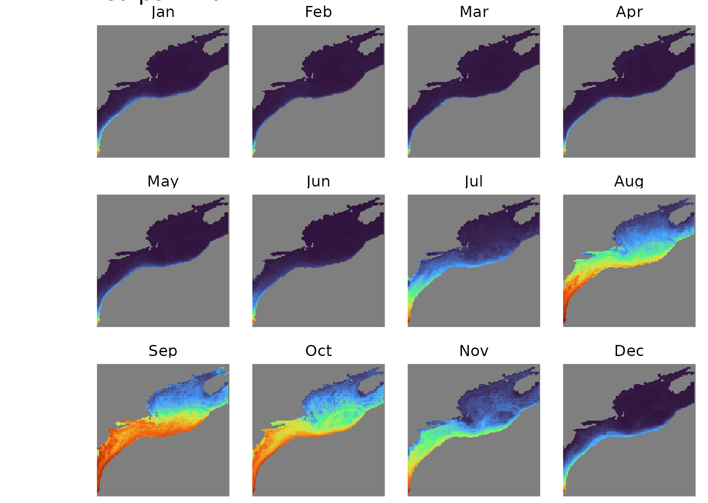
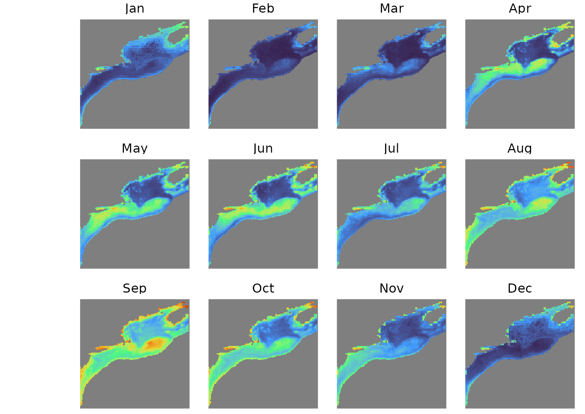
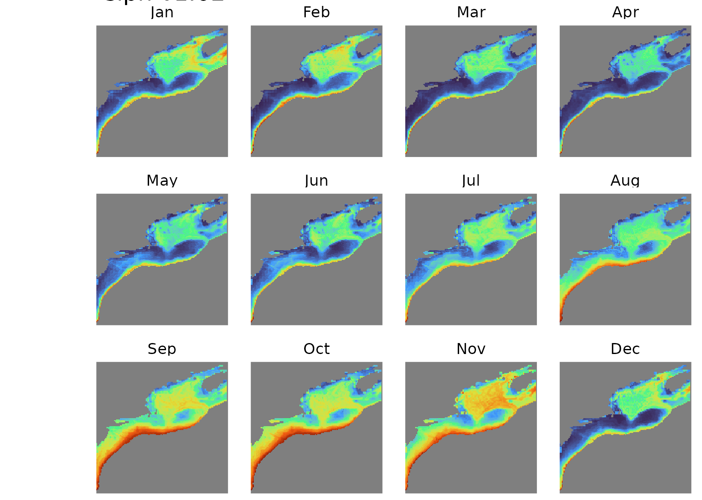

```{r setup, include=FALSE}
knitr::opts_chunk$set(echo = FALSE)
```

## Abstract

The Jelly Ocean Hypothesis posits that gelatinous zooplankton populations are increasing worldwide as a result of changing ocean conditions. This hypothesis has been the subject of debate in ocean science. We used time series analyses and a species distribution model to examine data from a 50-year survey of gelatinous zooplankton taxa on the Northeast US Continental Shelf Ecosystem. Time series analysis showed statistically significant increases in salps, siphonophores, and coelenterates (scyphozoans) in late summer and early autumn across the entire study region. Boosted regression tree models showed the probability of occurrence of gelatinous taxa were associated with day length, depth, and surface temperature for coelenterates; day length, surface and bottom temperature, and oxygen for salps; and day length, depth, bottom temperature, and oxygen for siphonophores. These results provide one line of evidence in favor of a long-term rise in gelatinous species. The roughly synchronized increases in these widely diverse taxa suggest that changes in environmental or ecological conditions favor a gelatinous body plan generally.

## Introduction

In zooplankton ecology, there has often been a “crustaceocentric” bias [@haddock2004golden]: gelatinous species, collectively termed gelata, have been underemphasized as compared to crustaceans. In the early 2000s, gelata moved into the spotlight, following conspicuous blooms that damaged fisheries [@kideys2005impacts], aquaculture [@clinton2021impacts], energy production [@wang2023aggregation], and recreation [@nunes2015analyzing]. In addition to motivating new research on gelata, these events raised the question of whether there was a larger pattern of change.

Emerging from a series of studies was the Jelly Ocean Hypothesis, which posits that gelatinous zooplankton populations are increasing worldwide as a result of changing ocean conditions. Proposed causes are primarily human-driven, including warming [@richardson2009jellyfish], eutrophication, translocation [@kideys2005impacts], overfishing, bottom trawling [@qiu2014coastal], pollution, aquaculture, and acidification [@richardson2008jellyfish]. There is also evidence that shifts toward the dominance of gelata are difficult to reverse because of dynamics like hysteresis [@richardson2009jellyfish]. The Jelly Ocean Hypothesis echoes a centuries-old concern; the 19th century novelist Jules Verne once predicted that, "crowded with jellyfish, squid, and other devilfish, the oceans will have become huge centers of infection” [@verne200620]. While the term "infection" might be unfair to jellyfish, who simply inhabit the ocean, the potential influence on human industry and recreation makes the question worthy of examination.

Testing the Jelly Ocean Hypothesis requires long time series (>30 years) of gelata abundances in order to compare current levels to historical levels. The sporadic nature of such datasets has left the Jelly Ocean Hypothesis largely unsupported [@condon2012questioning]. In lieu of time series, studies have used qualitative data, such as news reports, to argue that gelata are increasing globally [@brotz2012increasing]. However, it is difficult to distinguish these perceived increases from multi-annual or multi-decadal fluctuations. A recent meta-analysis of time series showed that most perceived increases appear to reflect a ~20 year cyclicity, with a worldwide upswing in the 1990s that coincided with the increase in concern over gelata [@condon2013recurrent], although some notable long-term increases in gelata were not included in the analysis [@atkinson2004long]. A metaanalysis of a corpus of research on this topic found flawed citations and misinterpreted conclusions [@sanz2016flawed], and at this point, the Jelly Ocean Hypothesis remains an open question.

In some ways, the Jelly Ocean Hypothesis is loosely posed. Gelata are taxonomically very diverse, encompassing multiple phyla. This diversity confounds attempts to quantify increasing trends. The list of species classified under the gelatinous umbrella varies based on the source, and includes taxa with drastic and important differences in their life histories, trophic positions, and ecological roles. For example, pelagic ctenophores are primarily copepod predators, whereas pelagic tunicates graze some of the smallest microbes. Cnidarians and ctenophores are the two most common taxa to group together in analysis, and yet they are phylogenetically very distant (Moroz et al. 2014). Perhaps the only characteristic common to the many gelatinous phyla is a body with a high water content, alternatively expressed as a low carbon:volume ratio. There is no _a priori_ reason to expect that phyla with such striking differences and perhaps only a superficial similarity should be grouped together with respect to their temporal trends. Some have suggested that the Jelly Ocean Hypothesis is ill-posed—i.e. which species are increasing, where, and for what reason (Gibbons & Richardson 2013)?

On the other hand, despite their major differences, there is some evidence that a diverse collection of gelata can vary together (Condon et al. 2013). If so, it is possible that certain conditions can favor the gelatinous body form in general over other strategies that utilize a high carbon:volume ratio (e.g. crustaceans). This position would reframe the Jelly Ocean Hypothesis in trait-based terms: conditions in the ocean ecosystem can shift to benefit the gelatinous body form. The effect would be inclusive of gelata in general, despite differences in phylogeny, trophic position, or other life history traits. 

We revisited the Jelly Ocean Hypothesis using a 50-year survey on the Northeast US Continental Shelf ecosystem. We addressed two main questions: 1) what are the temporal changes in gelata presence; and 2) what are the underlying conditions associated with these changes. We examined three taxonomic groups well-represented in the dataset--siphonophores, salps, and coelenterates--to explore the idea that certain conditions can favor the gelatinous body plan in general.

## Methods

### Survey Data

The Northeast Fisheries Science Center Ecosystem Monitoring (ECOMON) program has collected seasonal zooplankton measurements since 1977 as part of its mission to monitor and assess the Northeast Continental Shelf ecosystem (Figure 1). Sampling includes oblique tows using a 61 cm bongo net fitted with a 333 µm mesh at stratified locations across the shelf. Tows are a minimum of five minutes in duration and sample from the surface to within 5 m of the seabed or to a maximum depth of 200 m. A mechanical flowmeter fitted in the mouth of each net is used to quantify seawater volume sampled. Gelatinous zooplankton are identified into broad taxonomic groups, including siphonophores, ctenophores, salps, and coelenterates (i.e. scyphozoans). The broad grouping, while missing taxonomic detail, has allowed for internal consistency over the duration of the survey. Because of the absence of high taxonomic resolution, or any information on animal size in the samples, we used presence or absence of each taxonomic group in the analysis.


### Time series analysis

The ECOMON survey has varied in seasonal frequency over its duration. To correct for seasonal aliasing and spatial bias, we grouped samples by large spatial polygons that represent different habitats and analyzed the time series by month. Polygons include: Gulf of Maine, Georges Bank, New York Bight, and Mid Atlantic Bight [@walsh2015long]. We tracked the proportion of samples in a region and in a time period that contained presences, and we tested for statistically significant increases in the proportion of gelata presence over time using a bivariate correlation test against year.

### Spatial analysis

To test for environmental associations with the occurrence of gelatinous taxa across the study domain, we developed used a boosted regression tree algorithm for each taxonomic group. We used physical covariates from the Global Ocean Physics Reanalysis (GLORYS) and biogeochemical covariates from the Operational Mercator Ocean biogeochemical global ocean analysis (NEMO) obtained from the Copernicus repository (copernicus.eu). These products provide daily temporal resolution and 1/12 and 1/4 spatial degree resolution, respectively. Physical covariates included: sea surface temperature, sea bottom temperature, sea surface salinity, mixed layer thickness, and surface velocity magnitude. Biogeochemical covariates included: surface chlorophyll a, surface net primary productivity, surface oxygen, surface nitrate, surface phosphate, and surface silicate. We also included bathymetric depth and bathymetric slope. To determine the best way to represent seasonal dependencies, we conducted a series of experiments using predictors such as month, a rolling seasonality index, and the height and angle of the sun. Models using day length and the time derivative of day length had the strongest performance metrics, so we included those two covariates as well.

A common threshold for covariate removal due to cross-correlation is an r-squared value of 0.7. Because removal of covariates leads to information loss and decreased predictive power in tree-based algorithms [@hanberry2024practical], we kept all covariates. However, we included this information in our interpretation and conducted additional model runs to test the effect of cross-correlation. Pairs of covariates that crossed this threshold were: bathymetric depth against bathymetric slope (0.71), surface temperature against surface oxygen (0.89), surface temperature against day-length time derivative (0,79), surface chlorophyll-a against net primary productivity (0.81), and surface oxygen against day-length time derivative (0.77). Because of the high correlation between sea surface temperature and surface oxygen, and the physical relationship between the two (water temperature is related to oxygen content), we conducted a second set of runs using subsurface oxygen, taxen from 100 m depth (below the mixed layer), in place of surface oxygen. This change limited the extent of the model domain for these runs. 

Boosted regression trees are less prone to overfitting and well suited to data with sharp jumps or thresholds, as is the case for the gelatinous zooplankton data [@elith2005evaluation]. We modeled the likelihood of occurrence of each taxon using tidymodels workflows within the R programming language, optimizing the inbuilt area-under-curve (AUC) metric (Fielding and Bell 1997, Kuhn and Wickham, 2020). We used a set of hyperparameters optimized in a previous study that used the same dataset and methodology [@johnson2025suitability]; this choice was made following a separate tuning simulation that proved the resulting models highly insensitive to hyperparameters. We used a testing split of 25%, and ran a 25-fold cross-validated model to quantify algorithmic uncertainty around the median output. We used custom-built response curves [@johnson2025suitability] to interpret associations between model response and variations in environmental covariates (Elith et al., 2005).

## Results

### Time series analysis

Over almost five decades of measurements, there were consistent patterns of statistically significant increases in the recorded presence of gelatinous taxa (Figure 2, S1). While the survey does not cover every month in every year, there is enough coverage across seasons for consistent patterns to be clear. Out of 144 month-region combinations, 56 (39%) indicate a statistically significant increase (p < 0.05) and zero (0%) indicate a statistically significant decrease. Considering only the months of August-November, 40 of the 48 time series (83%) show a statistically significant increase (Figure 2).

Trend results during other times of year were mixed. On Georges Bank, there were statistically significant increases across the spring months for siphonophores and coelenterates. For the other combinations of taxa, regions, and months, there were no consistent pattern (Figure S1).


### Spatial analysis

Across the three taxonomic groups, For the boosted regression tree distribution model performed well. The coelenterates model had an AUC value of 0.79, an accuracy of 0.77, and an F-score of 0.49. The salps model had an AUC value of 0.93, an accuracy of 0.89, and an F-score of 0.72. The siphonophores model had an AUC value of 0.83, an accuracy of 0.77, and an F-score of 0.63. The model tended to favor specificity over sensitivity over all runs.

Covariate associations were somewhat consistent across taxonomic groups. Day length, surface and bottom temperature, and oxygen were the strongest covariates associated with the occurrence of salps; day length, depth, and surface temperature were the strongest for coelenterates; and day length, depth, bottom temperature, and oxygen were the strongest for siphonophores (Figure S2-4). Salps had a positive monotonic response to temperature at the surface and at depth, while the other taxa had broad modes of positive temperature response. Net primary production and mixed layer thickness were consistently the weakest covariates. For salps and siphonophores, and to some degree for coelenterates, the response increased at very low oxygen values. Because of the strong connection between surface oxygen and surface temperature, we ran a series of tests using oxygen at 100 m, below the mixed layer. These patterns persisted.

Model output for the three taxonomic groups had distinct seasonal cycles (Figure 3, S5-7). Salps were absent in the winter and spring, with a strong bloom in the autumn. The bloom was strongest in the Mid-Atlantic Bight, where nearly all samples contained salps, and extended northeast over Georges Bank, while presence remained generally low in the Gulf of Maine. Coelenterates were present year-round in most nearshore areas and generally absent over deeper waters, with minimum occurrence in the winter. Siphonophores had a more northerly range, with higher presence in deeper waters and a notably high presence over the continental slope in autumn.


## Discussion

Large aggregations of gelata can appear suddenly and often inspire widespread public interest [@record2018jelly]. These aggregations have occurred in the Northeast US Continental Shelf ecosystem, prompting the same questions that underlie the Jelly Ocean Hypothesis: Are jellyfish (gelata) increasing, and if so, what is the cause? For this region, we found spatially widespread statistically significant increases in gelata over fifty years, particularly during the late summer and autumn months (August through November). Notably, in the northern regions and in this late seasonal period, salps and siphonophores went from being rare in the early years to being nearly omnipresent in the recent years.

Determing the causal underpinnings of increased gelata is more complicated. The Northeast US Continental Shelf ecosystem has undergone notable oceanographic changes over the past fifty years, some of which are apparent in the gelata time series. There was a decadal shift among copepod species between the 1980s and the 1990s, reverting in the early 2000s, driven by changes in stratification [@pershing2024decadal]. This shift appears in many of the gelata time series as well (Figure 2). While mixed layer thinkness did not emerge as a strong covariate in the modeling exercise, these shifts could be respresented by surface salinity. In the Gulf of Maine in particular, a shift during the 1990s appears across taxa and is particularly pronounced for siphonophores (Figure S1). The region also underwent a decade of extreme rapid warming beginning around 2005 [@pershing2015slow]. This period does not stand out in particular in the gelata time series, except again among salps in the Gulf of Maine and perhaps Georges Bank (Figure S1). Finally, the region underwent an abrupt shift toward cold, fresh water beginning in autumn 2023 [@record2024early]. This aligns with the sharp drop in salp and siphonophore presence in fall of 2023. Taken in total, the evidence suggests that changing water masses could drive patterns of gelata, but without finer taxonomic resolution, or size or life stage information, it is difficult to assign causality directly.

The species distribution provides some evidence for associations between gelata and changing environmental variables. Salps showed a clear positive response to temperature, which is consistent with the expectation for the dominant species of salps known to inhabit the region -- e.g. Salpa spp. and Thalia spp. [@vargas2004zooplankton; @madin2006periodic]. In the Southern Ocean, a long-term increase in salps has been associated with warmer waters and lower productivity [@atkinson2004long]. Neither productivity nor chlorophyll stood out as a strong covariate in this modeling exercise, but the positive association with warmer temperatures was notable, as the pattern would have to be consistent across multiple species to emerge. 

Coelenterates did not have a monotonic relationship with temperature. This result is not surprising, as some of the most common scyphozoan jellyfish in the range have a subarctic distribution (e.g. Cyanea spp.). The strongest covariates for this taxonomic group were those related to seasonality and bathymetry--i.e. variables without long-term trends. While still significant, the increasing coelenterate trend was less pronounced when compared to the other taxa. A better understanding of the drivers of this trend would probably require a more taxonomically detailed dataset. 

Salps and siphonophores, and to some degree coelenterates, had a positive response to very low oxygen values. A test using subsurface oxygen, to account for the relationship between oxygen and temperature, maintained this pattern. Because of their low carbon-to-volume ratio, gelatinous species are often able to survive at oxygen levels that are too low for their competitors or that have a slowing effect on their prey [@purcell2001pelagic]. The results here are consistent with that property. One hypothesis for a cross-phylum increase in diverse gelata is that lower oxygen favors a gelatinous body plan.

## Conclusion

Our analysis using 50-year survey of the Northeast US Continental Shelf ecosystem showed strong evidence of an increase in occurrence across diverse gelatinous zooplankton taxa. In the context of the still-debated Jelly Ocean Hypothesis, the results contribute one piece of evidence in favor of a long-term rise in gelatinous species. The roughly synchronized increases in these widely diverse taxa suggest that changes in environmental or ecological conditions favor a gelatinous body plan generally. While there are a multiplicity of drivers of these changes, one hypothesis worth pursuing is the possibility that low oxygen favors gelatinous species generally. The survey data included broad taxonomic groupings, which limited the analyses and conclusions to some degree. Despite this limitation, the length and consistency of the time series enabled the discovery of some important multi-decadal patterns.

\newpage

## Supplement


![Figure S2. Response curves showing the marginal effects of environmental covariates on salps occurrence probability. Red vertical lines and shaded areas indicate the median valueand 95% interquantile range of the target covariate respectively. Shaded area indicates 95% interquartile range of the response while other covariates are held at their median values. Response curves are ordered from left to right and top to bottom by variable importance. Covariate names and units are detailed in Table T1.](./figscripts/response_curves_salp.png)

![Figure S3. Response curves showing the marginal effects of environmental covariates on coelenterates occurrence probability. Red vertical lines and shaded area indicate the median value and 95% interquantile range of the target covariate. Black lines and shaded area indicate median value and 95% interquantile range and median of model response while all other covariates are held at their median values. Response curves are ordered from left to right,top to bottom by variable importance. Covariate names and units are detailed in Table T1.](./figscripts/response_curves_coel.png)

![Figure S4. Response curves showing the marginal effects of environmental covariates on siphonophores occurrence probability. Red vertical lines and shaded area indicate the median value and 95% interquantile range of the target covariate. Black lines and shaded area indicate median value and 95% interquantile range and median of model response while all other covariates are held at their median values. Response curves are ordered from left to right,top to bottom by variable importance. Covariate names and units are detailed in Table T1.](./figscripts/response_curves_siph.png)








\newpage


## References


