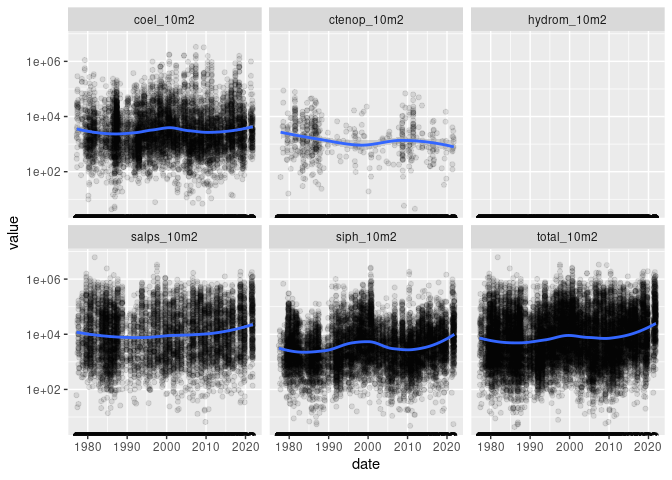
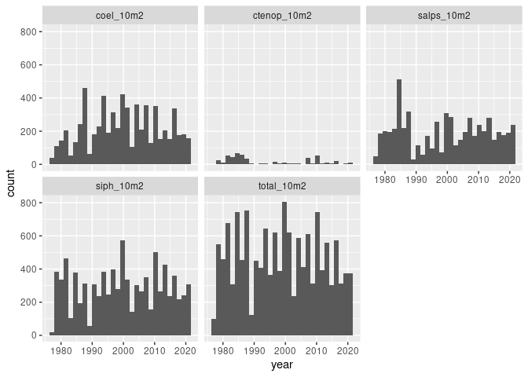
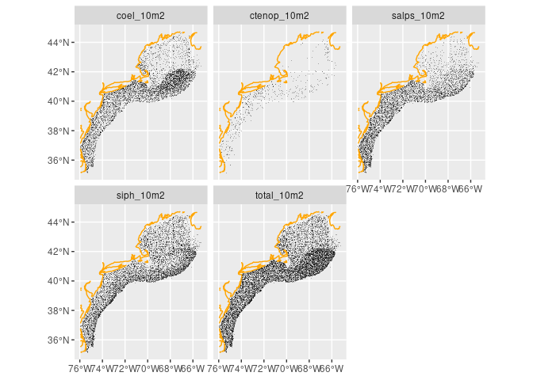

Observations
================

For the [Jellyscape](https://github.com/BigelowLab/jellyscape) project
observations are drawn from a recent release of unstaged
[ECOMON](https://www.fisheries.noaa.gov/about/northeast-fisheries-science-centern)
data. We choose the following groups to belong to the gelatinous
“jellyscape” although the list is easily modified.

- *Siphonophores* (siph)
- *Hydromedusea* (hydrom)
- *Coelenterates* (coel)
- *Ctenophores* (ctenop)

These we can read from the [ecomon
package](https://github.com/BigelowLab/ecomon) and aggregate these
species into a count per 10m^2 or count per 100m^3.

# The observation data

``` r
source("setup.R")
x = read_ecomon_spp() |>
  glimpse()
```

    ## Rows: 32,693
    ## Columns: 19
    ## $ cruise_name <chr> "AA8704", "AA8704", "AA8704", "AA8704", "AA8704", "AA8704"…
    ## $ station     <dbl> 42, 43, 44, 45, 46, 47, 48, 49, 50, 51, 52, 53, 54, 55, 56…
    ## $ zoo_gear    <chr> "6B3", "6B3", "6B3", "6B3", "6B3", "6B3", "6B3", "6B3", "6…
    ## $ ich_gear    <chr> "6B5", "6B5", "6B5", "6B5", "6B5", "6B5", "6B5", "6B5", "6…
    ## $ lat         <dbl> 38.7500, 38.9500, 38.9167, 39.1000, 39.2333, 39.3500, 39.2…
    ## $ lon         <dbl> -73.7500, -74.1167, -74.5500, -74.3167, -74.4333, -74.1000…
    ## $ date        <date> 1987-04-17, 1987-04-17, 1987-04-17, 1987-04-17, 1987-04-1…
    ## $ time        <time> 00:45:00, 02:50:00, 04:35:00, 06:05:00, 07:00:00, 08:35:0…
    ## $ depth       <dbl> 54, 46, 28, 24, 18, 26, 43, 79, 81, 56, 25, 18, 22, 28, 23…
    ## $ sfc_temp    <dbl> NA, NA, NA, NA, NA, NA, NA, NA, NA, NA, NA, NA, NA, NA, NA…
    ## $ sfc_salt    <dbl> NA, NA, NA, NA, NA, NA, NA, NA, NA, NA, NA, NA, NA, NA, NA…
    ## $ btm_temp    <dbl> NA, NA, NA, NA, NA, NA, NA, NA, NA, NA, NA, NA, NA, NA, NA…
    ## $ btm_salt    <dbl> NA, NA, NA, NA, NA, NA, NA, NA, NA, NA, NA, NA, NA, NA, NA…
    ## $ volume_1m2  <dbl> 18.91, 16.72, 12.32, 6.03, 3.50, 8.60, 9.87, 55.40, 57.48,…
    ## $ siph_10m2   <dbl> 0.00, 0.00, 0.00, 0.00, 0.00, 0.00, 0.00, 0.00, 0.00, 0.00…
    ## $ hydrom_10m2 <dbl> 0, 0, 0, 0, 0, 0, 0, 0, 0, 0, 0, 0, 0, 0, 0, 0, 0, 0, 0, 0…
    ## $ coel_10m2   <dbl> 27667.03, 0.00, 0.00, 0.00, 0.00, 0.00, 0.00, 6520.30, 150…
    ## $ ctenop_10m2 <dbl> 0, 0, 0, 0, 0, 0, 0, 0, 0, 0, 0, 0, 0, 0, 0, 0, 0, 0, 0, 0…
    ## $ total_10m2  <dbl> 27667.03, 0.00, 0.00, 0.00, 0.00, 0.00, 0.00, 6520.30, 150…

For most analyses here we want the same in long form.

``` r
long = ecomon_to_long(x) |>
  glimpse()
```

    ## Rows: 163,465
    ## Columns: 17
    ## $ cruise_name <chr> "AA8704", "AA8704", "AA8704", "AA8704", "AA8704", "AA8704"…
    ## $ station     <dbl> 42, 42, 42, 42, 42, 43, 43, 43, 43, 43, 44, 44, 44, 44, 44…
    ## $ zoo_gear    <chr> "6B3", "6B3", "6B3", "6B3", "6B3", "6B3", "6B3", "6B3", "6…
    ## $ ich_gear    <chr> "6B5", "6B5", "6B5", "6B5", "6B5", "6B5", "6B5", "6B5", "6…
    ## $ lat         <dbl> 38.7500, 38.7500, 38.7500, 38.7500, 38.7500, 38.9500, 38.9…
    ## $ lon         <dbl> -73.7500, -73.7500, -73.7500, -73.7500, -73.7500, -74.1167…
    ## $ date        <date> 1987-04-17, 1987-04-17, 1987-04-17, 1987-04-17, 1987-04-1…
    ## $ time        <time> 00:45:00, 00:45:00, 00:45:00, 00:45:00, 00:45:00, 02:50:0…
    ## $ depth       <dbl> 54, 54, 54, 54, 54, 46, 46, 46, 46, 46, 28, 28, 28, 28, 28…
    ## $ sfc_temp    <dbl> NA, NA, NA, NA, NA, NA, NA, NA, NA, NA, NA, NA, NA, NA, NA…
    ## $ sfc_salt    <dbl> NA, NA, NA, NA, NA, NA, NA, NA, NA, NA, NA, NA, NA, NA, NA…
    ## $ btm_temp    <dbl> NA, NA, NA, NA, NA, NA, NA, NA, NA, NA, NA, NA, NA, NA, NA…
    ## $ btm_salt    <dbl> NA, NA, NA, NA, NA, NA, NA, NA, NA, NA, NA, NA, NA, NA, NA…
    ## $ volume_1m2  <dbl> 18.91, 18.91, 18.91, 18.91, 18.91, 16.72, 16.72, 16.72, 16…
    ## $ longname    <chr> "Siphonophores", "Hydromedusea", "Coelenterates", "Ctenoph…
    ## $ name        <chr> "siph_10m2", "hydrom_10m2", "coel_10m2", "ctenop_10m2", "t…
    ## $ value       <dbl> 0.00, 0.00, 27667.03, 0.00, 27667.03, 0.00, 0.00, 0.00, 0.…

# Distribution through time

``` r
ggplot(data = long,
       mapping = aes(x = date, y = value)) + 
  geom_point(alpha = 0.1) + 
  geom_smooth(method = "loess", formula = "y~x") + 
  scale_y_continuous(trans='log10') + 
  facet_wrap(~name)
```

<!-- -->

Let’s look at coverage by year - note we are counting occurences
(absences dropped) which results in the exclusion of `Hydromedusea`.

``` r
long = mutate(long, year = as.numeric(format(date, "%Y")), 
              month = as.numeric(format(date, "%m")))

ggplot(data = filter(long, value > 0),
       mapping = aes(year)) +
  geom_histogram() + 
  facet_wrap(~name)
```

<!-- -->

And alternative is to look at the observations by month.

``` r
ggplot(data = filter(long, value > 0),
       mapping = aes(month)) +
  geom_histogram(stat = "count") + 
    scale_x_continuous(breaks = 1:12,
                       labels = function(x) month.abb[x]) +
  facet_wrap(~name)
```

<!-- -->

# Distribution through space

We can read the same data in a spatial form and plot that. Once again,
we exclude sample locations where there are abscences.

``` r
long = ecomon_as_sf(filter(long, value > 0)) 
coast = ne_coastline(scale = "medium", returnclass = "sf") |>
  st_crop(long)
```

    ## Warning: attribute variables are assumed to be spatially constant throughout
    ## all geometries

``` r
ggplot() +
  geom_sf(data = long, shape = ".", alpha = 0.3) + 
  geom_sf(data = coast, color = "orange") +
  facet_wrap(~name)
```

<!-- -->
